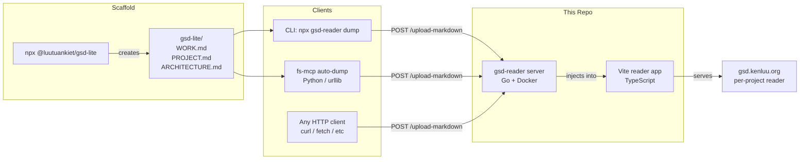
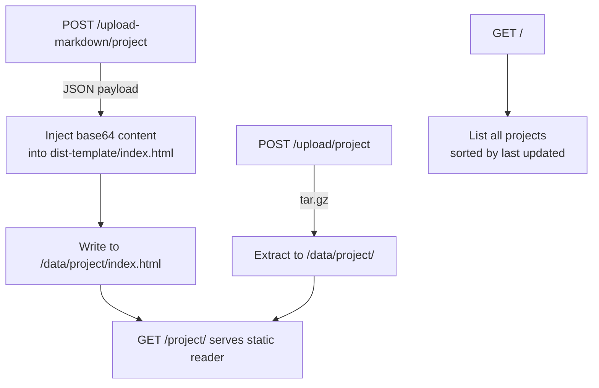

# gsd-reader

**The distribution layer for [GSD-Lite](https://github.com/luutuankiet/gsd-lite) artifacts.**

GSD-Lite is a pair programming protocol for AI agents — it produces structured markdown artifacts (`WORK.md`, `PROJECT.md`, `ARCHITECTURE.md`) that capture decisions, context, and session state. This repo holds all the tooling to **publish, serve, and consume** those artifacts from any client, on any machine.

> *Central place for utilities that help consume and send out GSD-Lite context on remote sessions, regardless of client.*

## How it fits together



The **protocol** (`@luutuankiet/gsd-lite`) scaffolds the artifacts. The **reader** (`@luutuankiet/gsd-reader`) distributes them.

## Quick Start

### 1. Scaffold a GSD-Lite workspace

```bash
npx -y @luutuankiet/gsd-lite
# Creates gsd-lite/WORK.md, PROJECT.md, ARCHITECTURE.md, ...
```

### 2. Upload to remote server

```bash
npx -y @luutuankiet/gsd-reader dump --remote=https://gsd.kenluu.org --user=ken
```

Or set env vars for zero-arg usage:

```bash
export GSD_READER_REMOTE=https://gsd.kenluu.org
export GSD_READER_USER=ken
export GSD_READER_PASS=secret
npx -y @luutuankiet/gsd-reader dump
```

### 3. Local dev server (live reload)

```bash
npx -y @luutuankiet/gsd-reader serve ./gsd-lite/WORK.md --port=3000
```

Browser auto-refreshes when any artifact changes.

## Architecture

This repo is a monorepo with two components:

```
gsd-reader/
├── cli.cjs                  # Node.js CLI (dump + serve)
├── src/                     # Vite reader app (TypeScript)
│   ├── main.ts              # Entry point, HMR, Mermaid init
│   ├── parser.ts            # Markdown → WorklogAST
│   ├── context-parser.ts    # PROJECT.md / ARCHITECTURE.md parsing
│   ├── renderer.ts          # AST → HTML (outline, content, gestures)
│   ├── diagram-overlay.ts   # Mermaid pan/zoom overlay
│   ├── syntax-highlight.ts  # Code block highlighting
│   └── vite-plugin-worklog.ts  # File watcher + HMR (dev mode)
├── server/                  # Go upload server
│   ├── main.go              # HTTP server (upload, render, serve)
│   ├── Dockerfile           # Multi-stage: npm assets + Go binary
│   ├── docker-compose.yaml  # Production deployment
│   └── .env.example         # Credential template
├── package.json             # npm: @luutuankiet/gsd-reader
└── .github/workflows/       # npm OIDC publish on v* tags
```

### Client: CLI (`cli.cjs`)

Two modes of operation:

| Command | What it does |
|---------|-------------|
| `dump` | Reads `WORK.md` + `PROJECT.md` + `ARCHITECTURE.md`, POSTs JSON to `/upload-markdown/{project}` on the remote server |
| `serve` | Starts a local Vite-powered dev server with WebSocket hot reload |

The dump command derives the project name from the last two path segments of the `gsd-lite/` directory (e.g., `my-project/gsd-lite` → project name `my-project/gsd-lite`).

### Server: Go (`server/main.go`)

Minimal Go HTTP server behind Cloudflare Tunnel. Three responsibilities:



- **Markdown upload** (`/upload-markdown/`): receives raw markdown, injects base64-encoded content into the pre-built Vite reader template, writes static HTML
- **Legacy upload** (`/upload/`): receives tar.gz of a pre-built static site
- **Serving**: static file server with project index page
- **Auth**: optional Basic Auth via `AUTH_USER` / `AUTH_PASS` env vars

The Dockerfile pulls `dist/` assets from the latest `@luutuankiet/gsd-reader` npm package at build time — so the server always uses the latest reader app without manual asset management.

### Reader App (`src/`)

Vite + TypeScript single-page app that renders GSD-Lite artifacts:

- **Multi-doc view**: `PROJECT.md` → `ARCHITECTURE.md` → `WORK.md` in a single scrollable page
- **Outline navigation**: collapsible sidebar (desktop) / bottom sheet (mobile) with all section headers
- **Copy to clipboard**: select sections from the outline, copies source-tagged markdown for LLM context injection
- **Mermaid diagrams**: native SVG rendering with pan/zoom overlay
- **Syntax highlighting**: code blocks with language detection
- **Deep linking**: `#line-N` anchors for precise section linking
- **Mobile-first**: responsive layout with touch gesture navigation

## Integration: Auto-dump from MCP servers

The `fs-mcp` server has built-in GSD auto-dump — when any `gsd-lite/` artifact is written via MCP tools, it automatically POSTs to the remote server after a 10-second debounce. This means every `WORK.md` update from a Claude Code session is automatically published.

Set these env vars on the MCP server host:

```bash
export GSD_READER_REMOTE=https://gsd.kenluu.org
export GSD_READER_USER=ken
export GSD_READER_PASS=secret
```

Any HTTP client that can POST JSON works — the protocol is simple:

```bash
curl -X POST https://gsd.kenluu.org/upload-markdown/my-project/gsd-lite \
  -H 'Content-Type: application/json' \
  -u ken:secret \
  -d '{"work": "# WORK.md content...", "project": "...", "architecture": "...", "base_path": "/path/to/gsd-lite"}'
```

## Server Deployment

```bash
cd server
cp .env.example .env
# Edit .env with your credentials
docker compose up -d --build
```

The server listens on port 8080. Put it behind a reverse proxy (Cloudflare Tunnel, nginx, caddy) for HTTPS.

## Development

```bash
# Install dependencies
pnpm install

# Dev server with hot reload
pnpm dev

# Build for production
pnpm run build

# Run tests
pnpm test
```

## Publishing

Tag a version to trigger the GitHub Actions npm publish:

```bash
git tag v0.2.28
git push origin v0.2.28
```

The workflow uses npm OIDC trusted publishing (no secrets needed). Supports dist-tags:
- `v1.0.0` → `latest`
- `v1.0.0-rc.1` → `next`
- `v1.0.0-dev.1` → `dev`

## License

MIT