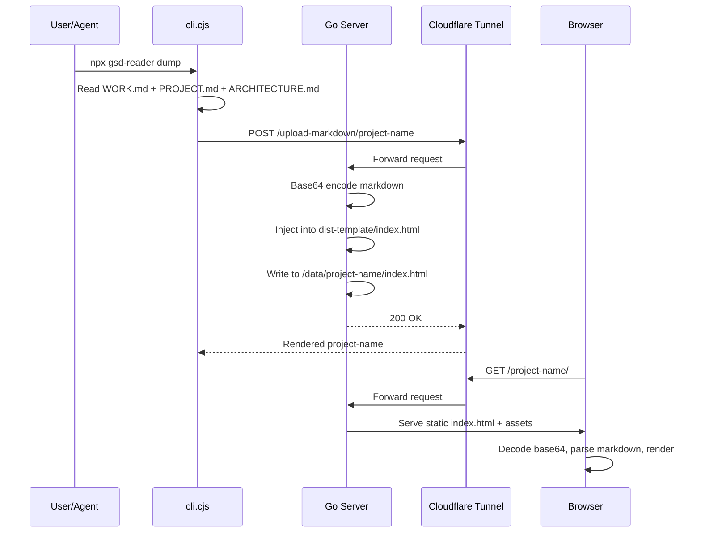

# Architecture

*Mapped: 2026-03-24*

## Project Structure Overview

| Directory | Purpose |
|-----------|---------|
| `cli.cjs` | Node.js CLI entry point — `dump` (upload) and `serve` (local dev) commands |
| `src/` | Vite + TypeScript reader app — parses and renders GSD-Lite markdown |
| `server/` | Go HTTP server — receives uploads, injects into reader template, serves static sites |
| `server/Dockerfile` | Multi-stage build: pulls npm `dist/` assets + compiles Go binary |
| `.github/workflows/` | npm OIDC publish on `v*` tags, PR preview via `pkg-pr-new` |
| `gsd-lite/` | This project's own GSD-Lite artifacts (meta: the reader reading itself) |

## Tech Stack

| Component | Technology | Why |
|-----------|-----------|-----|
| CLI | Node.js (CommonJS) | Must work via `npx` — no build step for end users |
| Reader app | Vite + TypeScript | Fast HMR for dev, optimized static build for prod |
| Markdown rendering | Custom parser (`parser.ts`) | GSD-Lite-specific structure: sections, logs, metadata tags |
| Diagrams | Mermaid 11 | Native SVG, pan/zoom overlay |
| Server | Go 1.22 | Single binary, zero runtime deps, low memory footprint |
| Deployment | Docker + Cloudflare Tunnel | Containerized, HTTPS via cloudflared |
| CI/CD | GitHub Actions + npm OIDC | Trusted publishing, no secrets |

## Data Flow

## Entry Points

| File | What it teaches you |
|------|--------------------|
| `cli.cjs:57-145` | `commandDump()` — the upload flow: read files → build JSON → POST to server |
| `cli.cjs:298-330` | `httpRequest()` — Node.js fetch wrapper with `autoSelectFamily` fix |
| `src/main.ts` | Reader app entry: loads content (embedded base64 or fetch), initializes Mermaid |
| `src/parser.ts` | Markdown → AST: how WORK.md structure is parsed into sections and logs |
| `server/main.go:handler()` | HTTP routing: upload, markdown-upload, serve, index |
| `server/main.go:handleMarkdownUpload()` | Server-side rendering: JSON → base64 → template injection |
